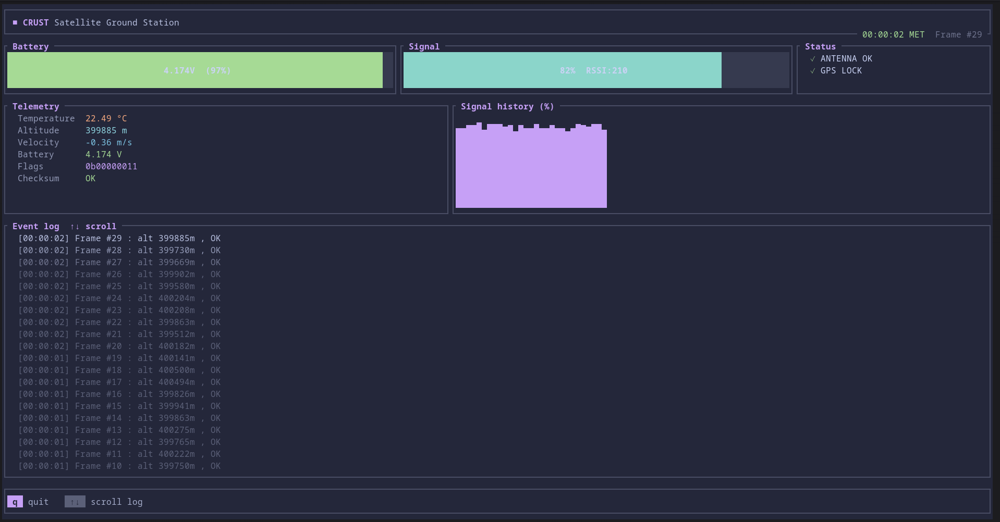

# 🛰️ Project CRust

A hybrid **C + Rust** application simulating a satellite ground station. C emulates low-level satellite hardware generating raw telemetry frames; Rust acts as the ground station
safely decoding the byte stream across an FFI boundary and rendering a live terminal UI dashboard.



---

## What is this?

CRust is a systems programming learning project that demonstrates:

- **C/Rust FFI** — calling C from Rust via `extern "C"`, passing raw pointers across a language boundary, and containing all `unsafe` code behind a safe Rust wrapper
- **Packed struct layout** — using `#pragma pack(1)` in C and `#[repr(C, packed)]` in Rust to guarantee identical byte layouts on both sides of the boundary
- **Zero-copy deserialization** — using `bytemuck` to reinterpret a raw `&[u8]` buffer directly as a typed Rust struct with no allocation overhead
- **Terminal UI** — a live-updating dashboard built with `ratatui` + `crossterm`, themed with the Catppuccin Macchiato palette

---

## Architecture

```
┌─────────────────────────────────────────────────────────────┐
│  C  (c_src/telemetry.c)                                     │
│                                                             │
│  Packed TelemetryFrame struct  →  raw byte buffer (*mut u8) │
└───────────────────────┬─────────────────────────────────────┘
                        │  FFI boundary
                        │  extern "C" + unsafe block
                        │  (src/ffi.rs)
┌───────────────────────▼─────────────────────────────────────┐
│  Rust  (src/)                                               │
│                                                             │
│  Vec<u8>  →  bytemuck cast  →  TelemetryFrame  →  ratatui  │
└─────────────────────────────────────────────────────────────┘
```

The C side owns no memory. Rust allocates the buffer, lends a raw pointer to C for the duration of a single call, then immediately reclaims ownership.
The `unsafe` block is fully contained inside `ffi::get_telemetry_frame()` — nothing unsafe is visible to the rest of the codebase.

---

## Telemetry Frame Layout

The satellite transmits an 18-byte packed frame with no padding:

```
Byte offset →  0        4    6    8           12   14  15  16
               ├────────┬────┬────┬───────────┬────┬───┬───┬────┤
               │  time  │temp│batt│  altitude │ vel│sig│flg│csum│
               │ u32 4B │i16 │u16 │  u32  4B  │ i16│ u8│ u8│u16 │
               └────────┴────┴────┴───────────┴────┴───┴───┴────┘
```

| Field | Type | Unit | Notes |
|---|---|---|---|
| `timestamp_ms` | `u32` | ms | Mission elapsed time |
| `temperature_c` | `i16` | 0.01 °C | 2314 → 23.14 °C |
| `battery_mv` | `u16` | mV | 4200mV = full, drains 1mV/tick |
| `altitude_m` | `u32` | m | ~400 km orbit with noise |
| `velocity_ms` | `i16` | cm/s | Signed delta velocity |
| `signal_strength` | `u8` | RSSI | 0–255, degrades over time |
| `status_flags` | `u8` | bits | See flag masks below |
| `checksum` | `u16` | — | XOR of all preceding bytes |

**Status flags** (bit masks on `status_flags`):

| Bit | Flag | Meaning |
|---|---|---|
| 0 | `ANTENNA_OK` | Antenna is operational |
| 1 | `GPS_LOCK` | GPS lock acquired |
| 2 | `LOW_BATTERY` | Battery below 3500mV |
| 7 | `ERROR` | Critical fault |

---

## Project Structure

```
crust/
├── Cargo.toml          # Dependencies + build script declaration
├── build.rs            # Compiles telemetry.c via the cc crate
├── c_src/
│   ├── telemetry.h     # Packed struct definition + C API
│   └── telemetry.c     # Satellite sensor simulation
└── src/
    ├── main.rs         # App state, event loop, ratatui TUI
    ├── ffi.rs          # extern "C" declaration + safe wrapper
    └── telemetry.rs    # Rust mirror struct + bytemuck parsing
```

---

## Tech Stack

| Crate | Version | Role |
|---|---|---|
| `cc` | 1.0 | Compiles `telemetry.c` into `libtelemetry.a` during `cargo build` |
| `libc` | 0.2 | C-compatible FFI types (`c_int`, `size_t`) |
| `bytemuck` | 1.16 | Zero-copy `&[u8]` → `&TelemetryFrame` cast |
| `ratatui` | 0.28 | Terminal UI layout and widgets |
| `crossterm` | 0.28 | Cross-platform raw terminal control |

---

## Getting Started

**Prerequisites:** Rust (stable), a C11 compiler (`gcc` or `clang`), and a terminal that supports 256 colors.

```bash
git clone https://github.com/yourusername/crust
cd crust
cargo run
```

`cargo build` automatically compiles the C satellite code via `build.rs`, no separate `make` step needed.

**Controls:**

| Key | Action |
|---|---|
| `q` / `Q` | Quit |
| up_arrow / down_arrow | Scroll event log |

---

## Dashboard

The TUI updates every 500ms and shows:

- **Battery gauge** — color shifts green -> peach -> red as the battery drains from 4200mV down to 3000mV
- **Signal gauge** — color shifts teal -> yellow -> maroon as RSSI degrades over time
- **Status flags** — live antenna, GPS lock, low battery, and error indicators
- **Telemetry panel** — temperature, altitude, velocity, battery voltage, raw status flags, checksum validity
- **Signal history sparkline** — rolling 32-frame RSSI history
- **Event log** — scrollable frame log with fading color hierarchy (newest -> oldest)

Themed with the [Catppuccin Macchiato](https://github.com/catppuccin/catppuccin) palette — mauve as the primary accent throughout.

---

## Key Concepts

**Why `#pragma pack(1)` and `#[repr(C, packed)]`?**
Without explicit packing, both C and Rust insert padding bytes between struct fields to satisfy CPU alignment requirements. Since each side inserts different amounts of padding independently, the byte layouts diverge and you read garbage. Forcing 1-byte packing on both sides guarantees identical layouts.

**Why `bytemuck` instead of manual deserialization?**
`bytemuck::from_bytes()` is a zero-copy pointer cast — it reinterprets the existing `Vec<u8>` buffer as a `TelemetryFrame` reference without allocating new memory or copying bytes. It is safe because `Pod` (Plain Old Data) guarantees the struct contains no padding, no pointers, and no bit patterns that could be invalid.

**Why is `unsafe` only in `ffi.rs`?**
Rust's FFI requires `unsafe` because the compiler cannot verify C function signatures or pointer validity at compile time. By containing all `unsafe` inside a single safe wrapper function, the rest of the codebase gets a normal `Result<Vec<u8>>` return type with no raw pointers escaping the boundary.

---

## License

MIT
